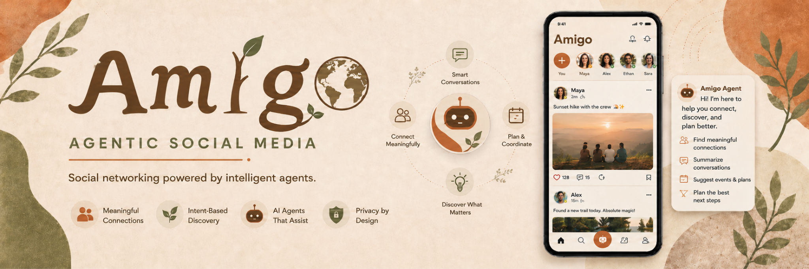

<p align="center">
  
</p>

# AmIgo

AmIgo is an early-stage social media platform designed with an **agentic approach**.  
The goal is to combine standard social media features with AI agents that can help users understand activity, manage reminders, summarize communities, and take useful actions inside the platform.

> Project status: Initial planning and development stage.

---

## Overview

AmIgo aims to be more than a regular social media app. Along with user profiles, posts, feeds, and communities, the platform will include AI-powered agents that can assist users through chat-based interaction.

Users will be able to ask the agent what they need, and the agent will help them perform actions such as setting reminders, summarizing community activity, and understanding public profile activity.

---

## Key Features

### Standard Social Media Features

- User login
- User sign-up
- User profile management
- Image posting
- Video posting
- Status posting
- Activity feed
- Community interaction

### Agentic Features

#### Reminder Agent

- Provides reminders at the end of the day
- Gives a summary of the user's whole day
- Provides an overview of overall platform activity

#### Community Agent

- Provides reminders related to community activities
- Gives a daily summary of each community
- Shows positive and negative insights about community engagement
- Highlights important updates, discussions, and activities

#### Agent Chat Feature

- Allows users to access platform features through an AI agent
- Users can chat with the agent and explain what they need
- The agent understands user requirements and takes relevant actions
- The agent can set reminders and sync them with Google Calendar

#### Community Summary

- Users can ask for a summary of any community
- The platform provides key updates, activities, discussions, and engagement insights

#### Public Profile Activity and Interest Summary

- Summarizes a person's public activities and interests
- Only uses information that the person has made public

---

## Possible Use Cases

- Personal social networking
- Community management
- Daily activity summaries
- AI-assisted reminders
- Public profile and interest discovery
- Community engagement analysis

---

## Initial Product Vision

AmIgo is being designed as a social media platform where AI agents act as smart assistants.  
Instead of users manually searching through all activities, posts, and communities, they can simply ask the agent for summaries, reminders, or insights.

Example prompts users may ask:

```text
Summarize my day.
```

```text
What happened in my communities today?
```

```text
Remind me about this community event tomorrow.
```

```text
Summarize this user's public interests.
```

---

## Tech Stack

The final tech stack is not confirmed yet.  
A possible initial stack may include:

- Frontend: React / Next.js
- Backend: FastAPI / Node.js
- Database: PostgreSQL / MongoDB
- AI Layer: LLM-based agent system
- Calendar Integration: Google Calendar API
- Storage: Cloud storage for images and videos
- Authentication: JWT / OAuth

---

## Suggested Project Structure

```text
AmIgo/
├── frontend/
│   └── README.md
├── backend/
│   └── README.md
├── agents/
│   ├── reminder_agent/
│   ├── community_agent/
│   └── profile_summary_agent/
├── docs/
│   └── feature-overview.md
├── README.md
└── .gitignore
```

---

## Getting Started

The project is currently in the initial stage.  
Setup instructions will be added once the frontend, backend, and agent architecture are finalized.

### Clone the Repository

```bash
git clone https://github.com/your-username/amigo.git
cd amigo
```

### Install Dependencies

```bash
# Instructions will be added after the tech stack is finalized.
```

### Run the Project

```bash
# Development run command will be added later.
```

---

## Roadmap

### Phase 1: Core Social Media Platform

- User registration and login
- User profile management
- Status posting
- Image and video posting
- Activity feed
- Basic community interaction

### Phase 2: Agentic Features

- Reminder Agent
- Community Agent
- Agent Chat Feature
- Community Summary
- Public Profile Activity and Interest Summary

### Phase 3: Integrations and Improvements

- Google Calendar sync
- Improved AI summaries
- Community engagement analytics
- Notification system
- Privacy and permission controls

---

## Privacy Considerations

AmIgo should only summarize public profile activity when the information is publicly available.  
Private user data should not be used for summaries without proper permission.

---

## Contributing

This project is in the early stage.  
Contribution guidelines will be added as the project structure becomes more stable.

---

## License

License information will be added later.
