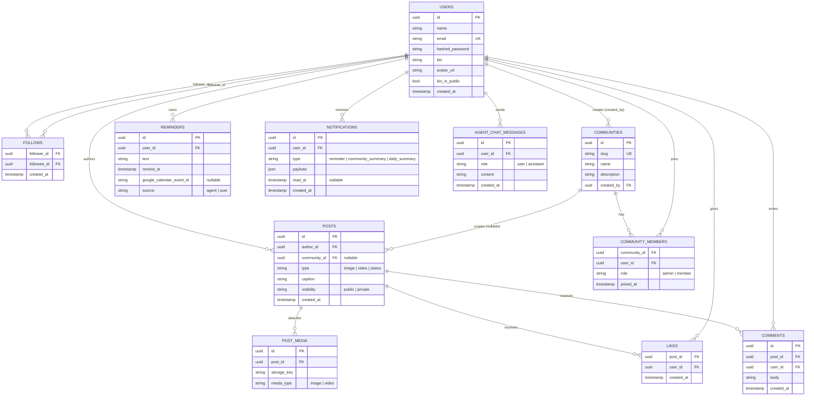

# AmIgo — Entity Relationship Diagram

Schema for the Phase 1 social platform (see `plan.md` > Data Model for the narrative version). 11 tables.

## Notes

- **`FOLLOWS` is a self-referencing join on `USERS`** (`follower_id` and `followee_id` both point to `users.id`) — Mermaid draws it as two relationships since it can't express one table joining to itself twice in a single edge.
- **`POSTS.community_id` is nullable** — a post either belongs to a community feed or is a plain profile/follow-feed post.
- **`POST_MEDIA` is one-to-many** — a single post can carry multiple images/videos (a carousel), not just one.
- **Feed assembly is query-time**, not a separate fan-out table — see `plan.md` > Data Model for why.
- **Privacy enforcement**: the Profile Summary Agent's queries filter on `POSTS.visibility = 'public'` and `USERS.bio_is_public = true` at the SQL layer — see `plan.md` > Agent Layer > Privacy constraint.
- **Not yet in this schema**: a `reposts`/share table (the feed UI has a share button, but re-sharing isn't modeled in Phase 1 — flagged during schema review, not yet confirmed to add).
